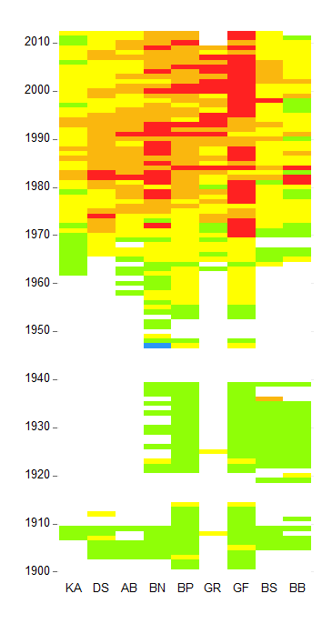

# HEAT figure

Example showing how Figure 3 from Andersen et al. 2015 was made.

<i>Andersen, J. H., Carstensen, J., Conley, D. J., Dromph, K., Fleming-Lehtinen, V., Gustafsson, B. G., et al. (2015). Long-term temporal and spatial trends in eutrophication status of the Baltic Sea. Biological Reviews. doi:10.1111/j.1540-8191.2009.00972.x.</i>

The script <a href="HEAT_figure.R" target="_blank">HEAT_figure.R</a> reads data from  <a href="HEAT Baltic by Basin.xlsx" target="_blank">HEAT Baltic by Basin.xlsx</a> to produce the following figure:

